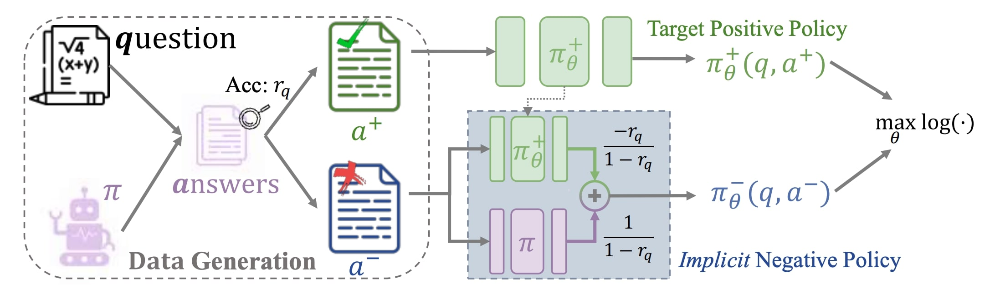
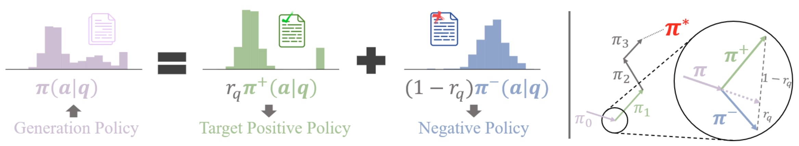
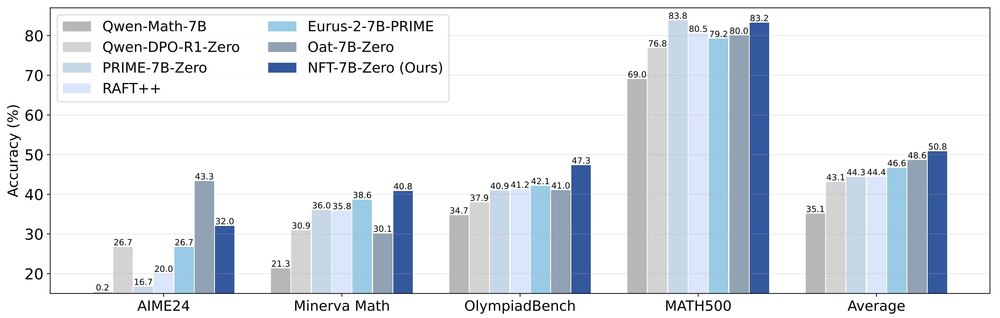
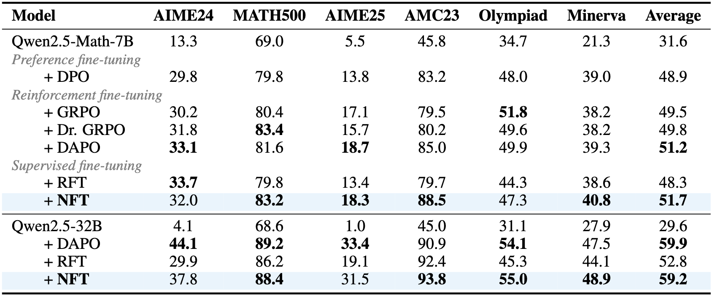
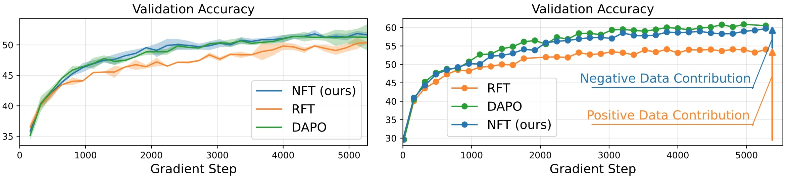

<div align='center'>
<h1>Negative-aware Fine-Tuning (NFT): Bridging Supervised Learning and Reinforcement Learning in Math Reasoning </h1>

<!-- TODO:  Thread,Paper,Dataset,Weights-->
[](https://arxiv.org/pdf/2505.18116)
[](https://research.nvidia.com/labs/dir/Negative-aware-Fine-Tuning/)
[](https://huggingface.co/datasets/ChenDRAG/VeRL_math_validation)
</div>

<p align="center">
  
</p>


NFT is a pure supervised learning method for improving LLMs' math-reasoning abilities with no external teachers.

- As an SL method, NFT outperforms leading RL algorithms like GRPO and DAPO in 7B model experiments and performs similarly to DAPO in 32B settings.
- NFT allows directly optimizing LLMs on negative data, thereby significantly outperforming other SL baselines such as Rejective sampling Fine-Tuning (RFT).
- NFT is equivalent to GRPO when training is strictly on-policy, despite their entirely different theoretical foundations.

NFT shows self-reflective improvement is not an inherent priority of RL algorithms. Rather, the current gap between SL and RL methods actually stems from their ability to effectively leverage negative data.

## Algorithm Overview

NFT bridges reinforcement learning and supervised learning methods through the leverage of negative feedback via supervision.


<p align="center">
  
</p>

The NFT pipeline consists of:
1. **Data Collection:** LLM generates answers to math questions, split into positive/negative based on correctness
2. **Implicit Negative Policy:** Constructs a policy to model negative answers using the same parameters as the positive policy
3. **Policy Optimization:** Both positive and negative answers optimize the LLM via supervised learning

<p align="center">
  
</p>

## Experimental Results

Comparison of NFT-7B with other zero-shot math models in the Qwen series.

<p align="center">
  
</p>


NFT performs competitively compared with other algorithms. We report avg@32 for AIME24, AIME25, and AMC23 and avg@1 for others.

<p align="center">
  
</p>


Validation accuracy curves showing NFT's ability to leverage negative data for continuous improvement.

<p align="center">
  
</p>


## Evaluation

### Environment setup
We use exactly the same environment configuration as the official DAPO codebase.
```bash
pip install git+ssh://git@github.com/volcengine/verl.git@01ef7184821d0d7844796ec0ced17665c1f50673
```

### Benchmarking

We provide the evaluation codebase integrated in the VeRL infra:

Please refer to `eval_local_7B.sh` and `eval_local_32B.sh` for evaluation scripts.

## Training

### Environment setup
We use exactly the same environment configuration as the official DAPO codebase.
```bash
pip install git+ssh://git@github.com/volcengine/verl.git@01ef7184821d0d7844796ec0ced17665c1f50673
```

### Datasets
We employ public dataset [DAPO-Math-17k](https://huggingface.co/datasets/BytedTsinghua-SIA/DAPO-Math-17k) for training, and 6 public math benchmarks for validation. Download pre-sorted training and validation data by
```bash
bash download_data.sh
```

### Base Model
```bash
bash download_model.sh
```

### Starting Experiments
Please see `train_7B.sh` and `train_32B.sh` for a running script (one node). Note that we run 7B experiments using 4×8 H100s, and 32B experiments using 16×8 H100s. Please refer to the instruction of [VeRL](https://github.com/volcengine/verl/tree/gm-tyx/puffin/main) for launching distributed tasks.

Hyperparameter:

- `neg_weight`: The weight of negative data in NFT's objective. Set to 1.0 for default NFT config. Set to 0.0 for RFT by masking out all negative data loss. Set to -1.0 for the DAPO algorithm for comparison.   
- `normalize`: Controls the prompt weight in NFT's objective. Set to 0 so that all question data is treated equally. Set to 1 (default) or 2 to prioritize harder questions. `normalize=1` matches Dr. GRPO algorithm in on-policy training, while `normalize=2` matches standard GRPO.

## Acknowledgement

We thank the [verl](https://github.com/volcengine/verl) for providing the awesome open-source RL infrastructure.

## Citation
If you find our project helpful, please consider citing
```bibtex
@article{chen2025bridging,
      title         = {Bridging Supervised Learning and Reinforcement Learning in Math Reasoning},
      author        = {Huayu Chen, Kaiwen Zheng, Qinsheng Zhang, Ganqu Cui, Yin Cui, Haotian Ye, Tsung-Yi Lin, Ming-Yu Liu, Jun Zhu, Haoxiang Wang},
      journal       = {arXiv preprint arXiv:2505.18116},
      year          = {2025}
}
```